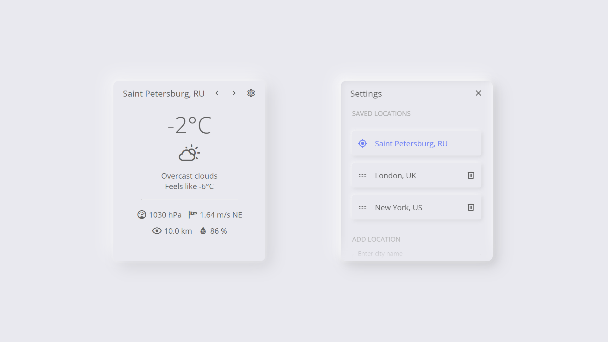

# vue-open-weather-widget


A minimalistic weather component for Vue. Weather data is taken from the [openweather](https://openweathermap.org/current) API.



## Demo

You can see the widget in action on this page:
https://vue-open-weather-widget.web.app/

## Get weather API key

You will need the open weather API key. You can get it for free on [openweather](https://openweathermap.org/current) website.

## Install

To add this component in your app, run the following command:

```
npm install vue-open-weather-widget
```
or
```
yarn add vue-open-weather-widget
```


## Import

```js
import OpenWeatherWidget from 'vueOpenWeatherWidget'
import 'vue-open-weather-widget/dist/vue-open-weather-widget.css'

export {
  components: {
    OpenWeatherWidget
  }
}
```

## Use

```html
<div class="weather-widget-container">
  <open-weather-widget :api-key="weatherApiKey"/>
</div>
```

## Style

You can style the component with CSS. Just make sure your styles have higher specificity than the component's styles. The easiest way to do this is to add `#app` in the selectors. For example:

```SCSS
<style lang="scss">
:root {
  --bg-color-1: rgb(233, 233, 239);
}

.weather-widget-container {
  width: 320px;
  height: 380px;
  border-radius: 12px;
  box-shadow: 
    0px 0px 2px 4px rgba(255, 255, 255, 0.1),
    -12px -12px 32px rgba(255, 255, 255, 0.5),
    12px 12px 32px rgba(0, 0, 0, 0.1);
}

#app .open-weather-widget {
  border-radius: 12px;
  background-color: var(--bg-color-1);
  &__input-element {
    & label {
      background-color: var(--bg-color-1);
    }
  }
  &__sortable-list {
    &__item {
      padding: 12px;
      margin: 16px 0;
      background-color: var(--bg-color-1);
      border-radius: 4px;
      border: none;
      box-shadow: 
        -2px -2px 8px rgba(255,255,255,0.6), 
        2px 2px 8px rgba(0,0,0,0.1);
    }
  }
}

#app #open-weather-widget {
  &__loading-screen {
    background-color: var(--bg-color-1);
  }
}
</style>
```

## API

#### Props:

<table>
  <thead>
    <tr>
      <th>Prop</th>
      <th>Type</th>
      <th>Default</th>
      <th>Required</th>
    </tr>
  </thead>
  <tbody>
    <tr>
      <td>
        api-key
      </td>
      <td>
        string
      </td>
      <td>
        undefined
      </td>
      <td>
        required
      </td>
    </tr>
  </tbody>
</table>

## For developers

#### Install
```
yarn
```

#### Start dev server for the component
```
vue serve src/components/OpenWeatherWidget.vue
```

#### Compile and minify for production
```
yarn build
```